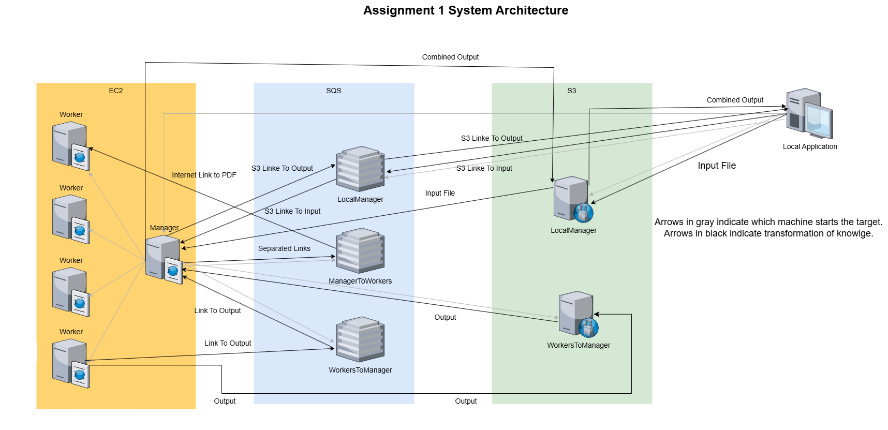

<!-- Markdown file -->
<!-- In VS code, use ctrl + shift + v to see preview -->
<!-- In IntelliJ, Click the "Preview" icon (top-right) or use Ctrl/Cmd + Shift + A and search for "Markdown Preview." -->

 

# READEME

## How to run

 

**Note: The system's logic and AWS architecture were finalized, but due to time constraints, the code is in beta version and does not run smoothly.**

1. Use the fatpom.xml: change bigpom.xml to pom.xml And pom.xml to originalPom.xml.
   In the cmd run:
2. mvn clean package (needed only if new dependencies are added)
3. mvn dependency:copy-dependencies (needed only if new dependencies are added)
4. mvn package
5. Swuch back to originalPom.xml (change it's name to pom.xml)
5. java -cp target/Assignment1-1.0-SNAPSHOT.jar:target/dependency/\* Assignment1.LocalApplication input-sample-1.txt outputFileName.txt n terminate

 
 

**Runing with Amazon Web Services**

**We used instance of type T2_NANO with ami: "ami-00e95a9222311e8ed".**

<!-- dealete ami if publied  -->

 

## System Overview

 

[System Architecture Diagram](https://drive.google.com/file/d/1eUvCboxx64iXHZsguHVfUJEjFcMaDMJf/view?usp=sharing) &nbsp; &nbsp; [Diagram as photo](https://drive.google.com/file/d/1-_z2TBPwo3r0QdSevMOjwZ-znCDvqvay/view?usp=sharing)

### The system consisting of the following components:

#### 1. Local Application

#### 2. EC2 Manager Node

- Creates worker nodes, controls the data flow, monitors the number of workers, splits the input into tasks, distributes them to workers and combines the results.

#### 3. EC2 Worker Nodes

#### 4. S3 Storage

#### 5. SQS Queues

 

The system uses S3 as a common storage and SQS as central method for communication. The design enables the Manager to assign tasks to the Workers by sending messages to a queue. The Workers, during their free time, can then retrieve and process these tasks.

The Manager only performs the simple task of defining the task and placing it in the queue, without needing to find a free worker or manage task distribution.
The Workers are not disturbed while working and can easily check if there are additional tasks to process.

 

## System Scalability

The Manager monitors the number of worker nodes and dynamically adjusts their count based on the workload.

The system is built such that all the components work with a common data storage and communicated using common queues. As such, the components do not interact directly resulting The amount of communication is linear in the number of components. This design ensures that the Manager node, or any other component, does not need to communicate with a large number of nodes, making the design scalable.

Additionally, the system uses S3 storage and SQS, which can store an adjustable amount of data and messages.

The main weakness of the design is the Manager, which operates as a single node. However, this weakness is mitigated because the Manager performs only simple and fast tasks. Additionally, it operates with several threads in parallel, enabling it to handle a higher workload.

 

## System Persistence

The system is persistent and can handle the failure of of its components.

-If a worker node fails, it will stop taking new tasks. Additionally, thanks to the Amazon SQS visibility timeout process, the message will reappear in the queue, allowing another worker to take over the task. The Manager monitors the number of worker nodes and will launch a new instance to replace the one that failed.

- Both S3 and SQS provide live backups and ensure durability of the data.

[Data Durability in Amazon S3](https://docs.aws.amazon.com/AmazonS3/latest/userguide/DataDurability.html) &nbsp; &nbsp; [Amazon SQS Documentation](https://docs.aws.amazon.com/AWSSimpleQueueService/latest/SQSDeveloperGuide/welcome.html)

- If the manager fails, the data is still secure, but the process will only continue once a new manager node is manually created or the local application is re-runed.

 

## System Decentralization

The system consists of multiple independent components, each operating on separate machines. These components communicate through shared storage (S3) and message queues (SQS), enabling them to function autonomously while exchanging data.

The system operates in parallel as tasks are processed concurrently by multiple Worker Nodes. The workers do not wait for others to finish and can independently retrieve additional tasks from the queue.
